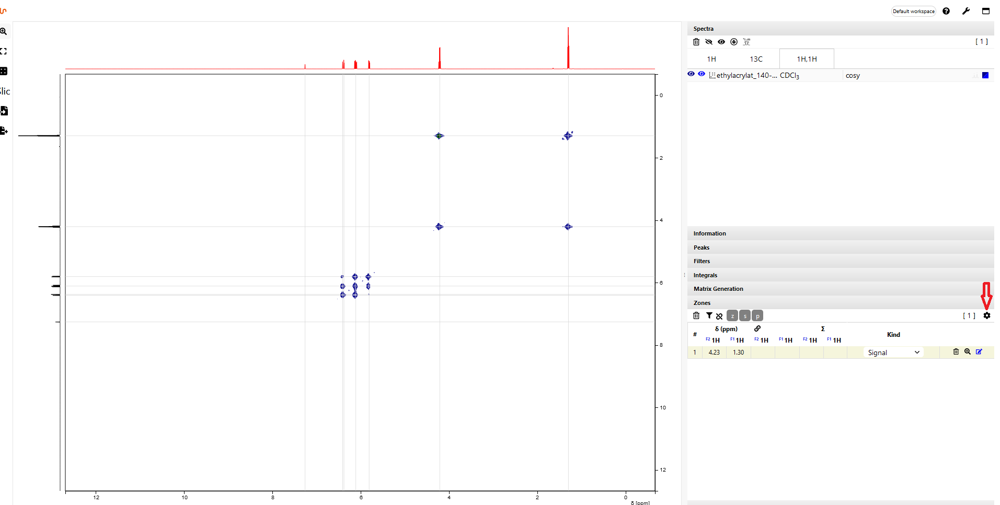
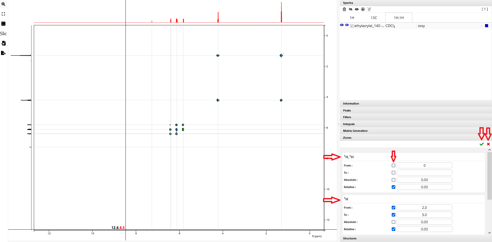

# Zones

A zone is a correlation between a proton and a carbon (or between two protons). Each zone has a center and defines the area that contains the associated signals.

## Define zones

### Auto zones picking

NMRium tries to find the zones that should be integrated. Click the **Zones Picking** button, set a noise factor, then press the **Auto Zones Picking** button. The detected zones are listed in the **Zones** panel on the right side of the workspace.

### Manual zones picking

Click the **Zones Tool** button. Move the mouse to the region of interest, hold the <kbd>Shift</kbd> key and the left mouse button, drag over the whole zone, then release both. The exact coordinates of the zone appear in the **Zones** panel on the right.

### Transferring chemical shifts from the 1D spectra

When you perform peak picking or automatic range picking on a 1D proton spectrum, grey vertical lines appear in the 2D spectrum at the chemical shifts of the 1D proton signals. The same applies to 1D carbon spectra, which display grey horizontal lines.

### Panel Zones

All zones are shown in the **Zones** panel. The zones highlighted in yellow can be observed in the section of the spectrum shown in the workspace. The zones highlighted in white are not visible in the screen section. If you switch off the zoom by double-clicking, the signals of the whole shown spectrum are highlighted in yellow. If you click on the funnel button, only the signals shown on the screen are listed. To see all the signals in the list again, press the Funnel button a second time.

You can display various information in the **Zones** panel. Click on the gear wheel at the top right.

All measured nuclei will be displayed. You can choose to display the following values for each nucleus. You can set the value in which the zones are displayed. To use this, enter a value for both "From" and "To" and set a check mark in the corresponding box. You can also specify whether you want the absolute or the relative zones to be displayed by setting the corresponding check mark. Then click on the green check mark at the top right. If you do not want to change anything, click the red cross at the top right.

### Delete a single zone

To delete one zone, move the mouse to the **Zones** panel, select a zone, and press the trash button on the right side of its row. The zone is deleted.

### Delete all zones

To delete all zones, move the mouse to the **Zones** panel and press the trash button on the left side above the list. A red confirmation box appears. Click **Yes**, and all zones are deleted.

### Set a reference

Click the **Zones Tool** button to the left of the spectrum. Find your solvent zone (or the reference zone). When you point at it with the crosshairs, press the <kbd>Shift</kbd> key and the left mouse button at the same time. The value of the signal appears in the **Zones** panel on the right. Double-click the proton value and enter the correct reference value, then do the same for the carbon value. All other values update accordingly.
