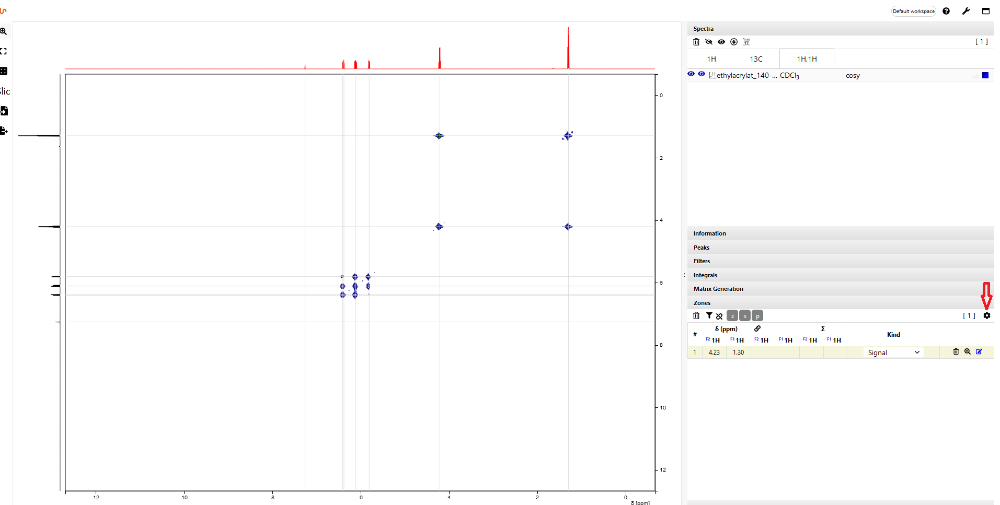
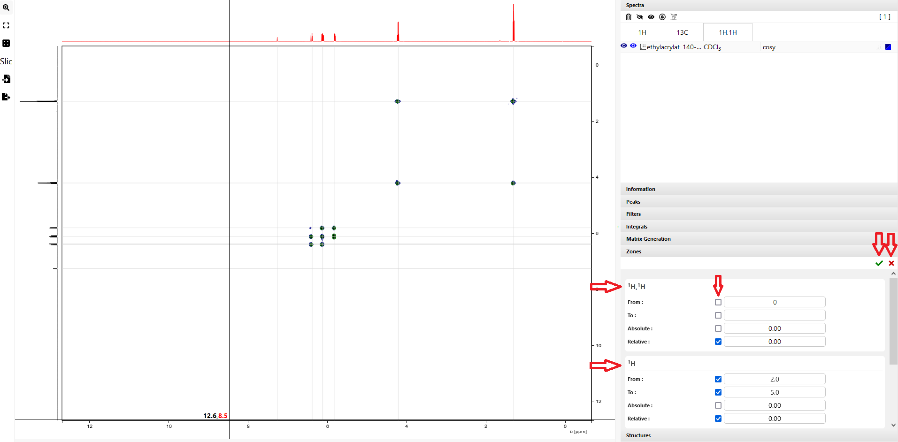

# Zones

A zone is a correlation between a proton and a carbon. Every zone has a center. It is a area that contains all signals.

## Define zones

### Auto zones picking

NMRium try to find out what are the zones that should be integrated. Click the zones picking button. Select a specified noise factor. Then press the **Auto Zones Picking** button. The zones found by NMRium are listed in the **Zones** panel on the right side of the workspace.

### Manual zones picking

To select a single zone, click the **Zones Tool** button. Move the mouse to the selected zone. Click on it with the left mouse button. Simultaneously press the <kbd>SHIFT</kbd> key on the keyboard, drag over the whole zone and release the mouse button and the shift button. The exact value of the zone can be found in a table on the right side in the panel zones.

### Transference of the chemical shifts from the 1D spectra

If you do in a 1D proton spektrum peak picking or automatic range picking, automaticly you can see grey vertical lines in the 2D spectrum which correspond to the chemical shifts of the 1D proton signals. If you di in the 1D carbon spectrum peak picking or range picking, there also are grey horizobtal linesin the 2D spectrum which correspond to the chemical shift of the 1D carbon signals.

### Panel Zones

All zones are shown in the **Zones** panel. The zones highlighted in yellow can be observed in the section of the spectrum shown in the workspace. The zones highlighted in white are not visible in the screen section. If you switch off the zoom by double-clicking, the signals of the whole shown spectrum are highlighted in yellow. If you click on the funnel button, only the signals shown on the screen are listed. To see all the signals in the list again, press the Funnel button a second time.

You can display various information in the **Zones** panel. Click on the gear wheel at the top right.

All measured nuclei will be displayed. You can choose to display the following values for each nucleus. You can set the value in which the zones are displayed. To use this, enter a value for both "From" and "To" and set a check mark in the corresponding box. You can also specify whether you want the absolute or the relative zones to be displayed by setting the corresponding check mark. Then click on the green check mark at the top right. If you do not want to change anything, click the red cross at the top right.

### Delete a single zone

To delete one zone move the mouse to the **Zones** panel and select a zone. Press the trash button on the rigth side of the line of the zone. The zone is deleted.

### Delete all zones

To delete all zones move the mouse to the panel zones and press the trash button on the left side above the list. A red box apears. Click **yes**. All zones are deleted.

### Set a reference

Click the **Zones Tool** button to the left of the spectrum. Find your solvent zone (or the reference zone). When you point at it with the crosshairs, press the <kbd>SHIFT</kbd> key and the left mouse button at the same time. The value of the signal will be shown in the list on the right side of the spectrum in the **Zones** panel. Click twice on the proton value and enter the correct reference value. Than click twice on the carbon value and also enter the correct value. All the values of the spectra will change.
