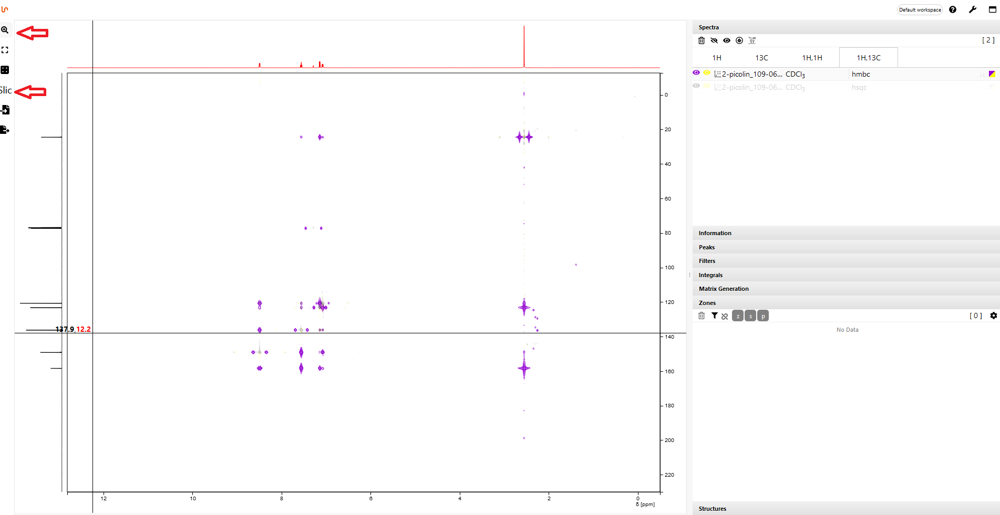

# Slicing Tool

With the slicing tool you can display the shift on the x-axis and the y-axis for each point of a 2D spectrum. To do this, click on the Slic button on the right side of the spectrum. A crosshair appears, which you can move with the mouse. Move the crosshair to the point you are interested in. The corresponding shifts are displayed in the crosshairs.

To exit the slicing tool, click the Zoom button at the top left of the toolbar.

