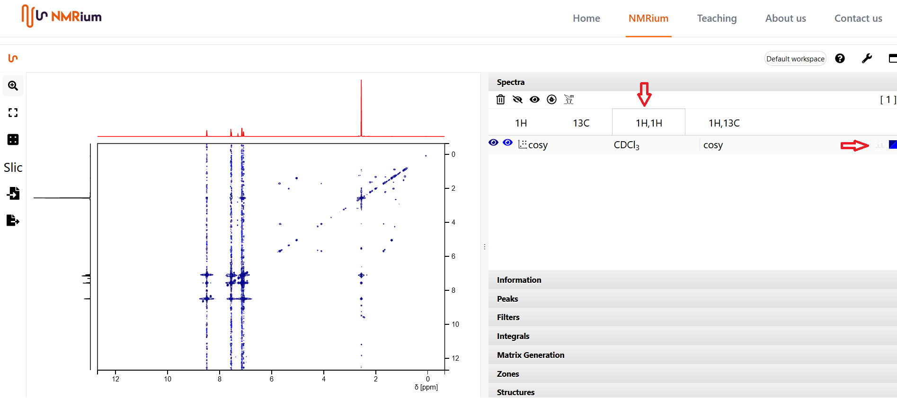
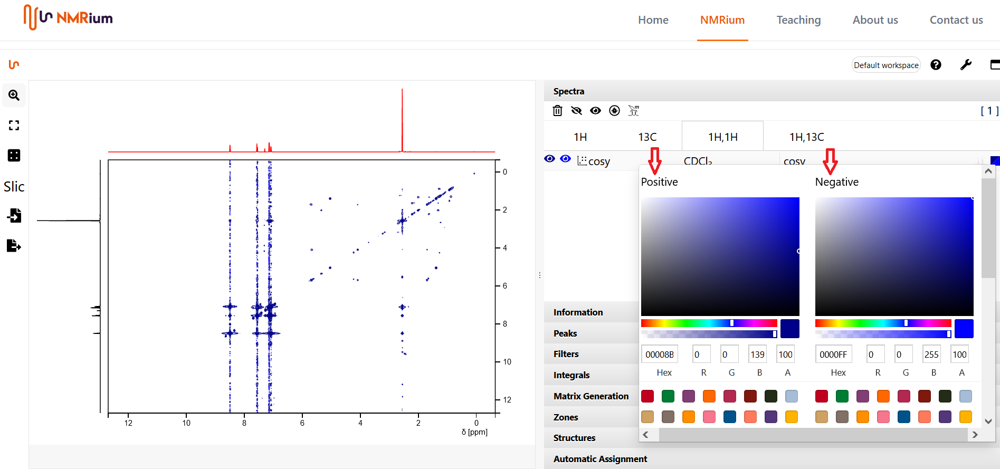

# Colors

When loading 2D spectra, NMRium automatically assigns positive and negative colors using the following rules:

| Experiment | Positive color | Negative color |
| ---------- | -------------- | -------------- |
| cosy       | dark blue      | blue           |
| noesy      | pink           | yellow         |
| roesy      | pink           | yellow         |
| tocsy      | green          | yellow         |
| hsqc       | black          | yellow         |
| hmbc       | dark violet    | yellow         |

You can change the colors of the positive and negative signals. Open the **Spectra** panel, select the spectrum whose color you want to change (e.g. the COSY listed under the **1H,1H** button), and click the colored box on the right side of its row.

A box opens where you can set separate colors for positive and negative signals. When you are done, click anywhere on the workspace outside the box and the colors are updated.

The traces shown alongside a 2D spectrum use the color of the corresponding 1D spectrum. To change those colors, edit the underlying 1D spectrum.
