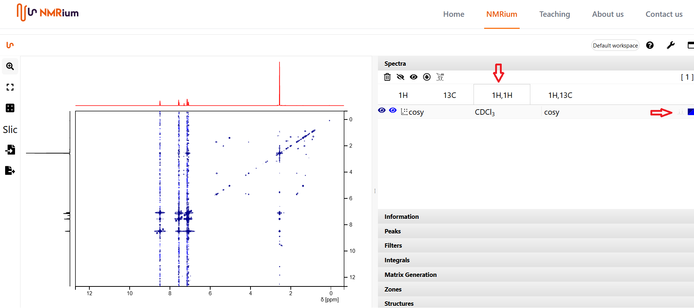
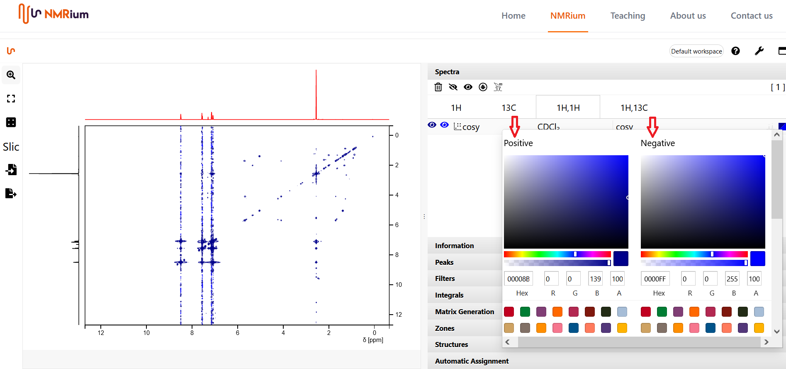

# Colors

When loading 2D spectra in NMRium automatic positive and negative colors are applied following the following rules:

| Experiment | Positive color | Negative color |
| ---------- | -------------- | -------------- |
| cosy       | dark blue      | blue           |
| noesy      | pink           | yellow         |
| roesy      | pink           | yellow         |
| tocsy      | green          | yellow         |
| hsqc       | black          | yellow         |
| hmbc       | dark violet    | yellow         |

You can change the colors of the positive and negative sinals. To do this, open the Spectra panel. Select the spectrum of which you want to change the color, e.g. the cosy that you can find under the button 1H, 1H. Click on the colored box on the right side of the corresponding line. 

A box will open. There you can change the color for the positive signals as well as for the negative signals. When you are done, click anywhere on the workspace outside the box. The colors will be changed. 

