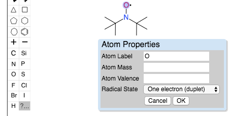
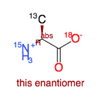

## Editing atom properties (radical, isotopes, etc.)

In the OpenChemLib editor you can specify radicals. Select the  button and click the atom you want to modify. You can then enter a specific mass (isotopes), an atom valence, or a radical state.

