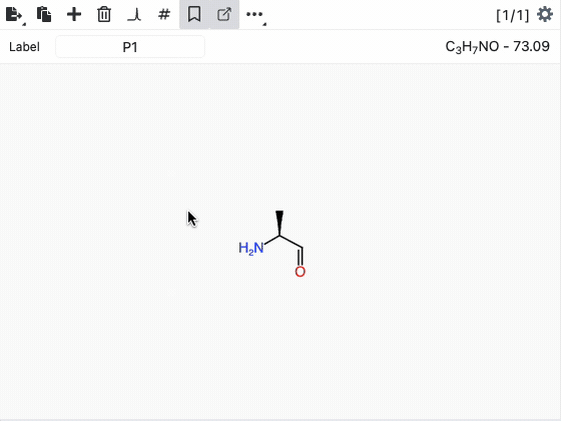
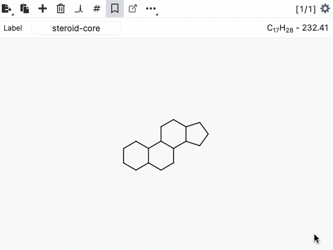
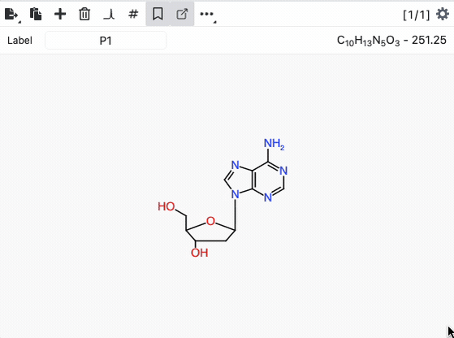
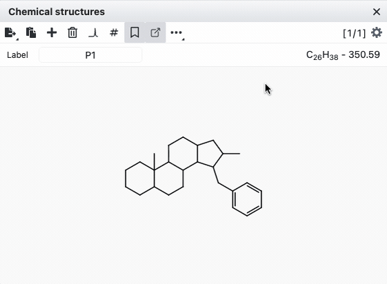
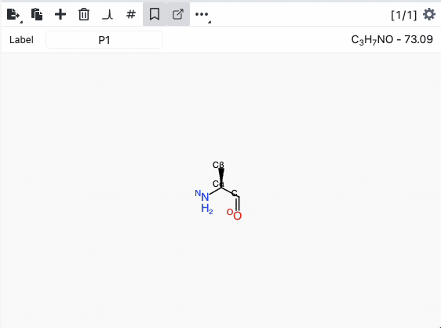
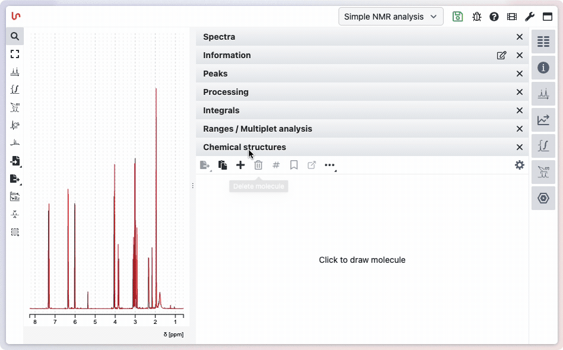

# Labelling chemical structure

In natural product chemistry, labeling the different atoms of a molecule is essential. This process can be time-consuming, but NMRium provides several tools to streamline and accelerate the labeling workflow.

After drawing your chemical structure, you can quickly add labels by clicking on atoms in the display mode and manually adding a label.

There is also a faster method: simply press the <kbd>space</kbd> key to assign the next atom label to the atom you're hovering over. The next label will be based on the last atom you specified (using the click-on-atom dialog box).

NMRium automatically remembers the last label and generates the next one sequentially. For example, if the last label is <kbd>2'</kbd>, pressing <kbd>space</kbd> will set the next label to <kbd>3'</kbd>.

## Auto labelling

NMRium includes many chemical templates with pre-assigned atom labels. For many natural products, you can apply the correct labeling with a single click.

:::tip Didn't find your template?

We'd be happy to add new templates with their corresponding labels to NMRium. Simply draw your template with the correct labels and save it as a MOL file V2000. You can then send these files to us. Here's a video showing the process.

:::

## Recall an existing molecule template

NMRium includes over 100 searchable templates that you can easily retrieve to begin drawing your chemical structure. Simply open the template database, search for your compound, and click <kbd>+</kbd> to add the chemical structure to the structure panel.

