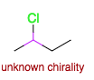
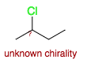

Stereochemistry in organic chemistry is a complex topic. You may encounter axial chirality, racemic compounds, mixtures of diastereoisomers, and more. The OpenChemLib editor supports Enhanced Stereo Recognition (ESR), a feature introduced by Molecular Design Ltd. with IsisDraw V2.5. ESR tools allow you to define, for each stereocenter, whether it has an absolute configuration or belongs to a group of stereocenters with a relative configuration. For any group of relative stereocenters, you can specify that both the drawn and the inverse configurations are present, indicating a racemic mixture. This is shown by green stereo bonds and an ampersand ('&') at the stereocenters. Alternatively, you can define groups of relative stereocenters that contain either the drawn configuration or its opposite. These are indicated by blue stereo bonds and the word 'or' at the stereocenters. Group numbers are used to show which stereocenters belong to the same group.

## One chiral center: 2-chlorobutane

The OpenChemLib editor will enforce chirality. If there is too much or not enough information about stereochemistry, it will be represented by pink bonds.

Even with this simple molecule, there are three possibilities:

- There is only one enantiomer and we know which one.
- We have a mixture of both enantiomers (&).
- There is only one enantiomer, but we don't know which one (or).

To differentiate between these three possibilities, three enhanced stereo recognition bonds are available.

To switch between the different stereochemical possibilities, first add a chiral bond to your structure. Then, use the enhanced stereochemistry tool to select one of the three options: only this enantiomer, both enantiomers (racemic mixture), or one enantiomer with unknown configuration. This allows precise control over how stereochemistry is represented in your molecule.

Alternatively, you can also specify that the configuration of the chiral center is unknown using .

## Two chiral centers: 2,3-bromochlorobutane

Each chiral center can be addressed separately, and many possibilities exist. Here are a couple of examples:

- Two chiral centers, but the relationship between the two centers is fixed and you obtain a pair of enantiomers (racemate):

- Only one enantiomer with a known relationship between the two chiral centers:

- Absolute configuration of one chiral center and one of the two possible diastereoisomers:

- Absolute configuration of one chiral center and both possible diastereoisomers:

## Axial chirality

The OpenChemLib editor is able to handle axial chirality, as in the case of allenic or binap systems.

