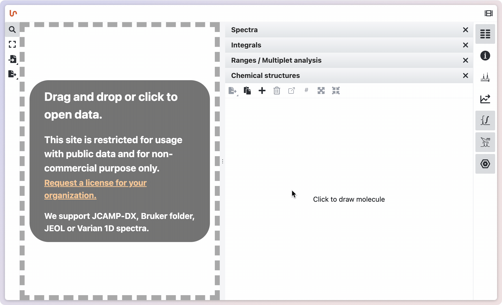
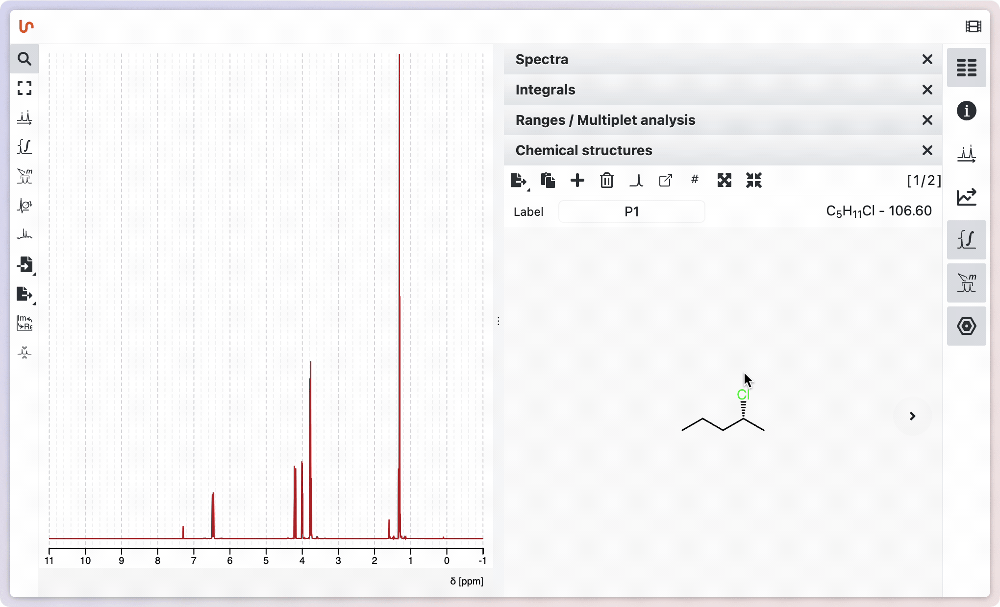
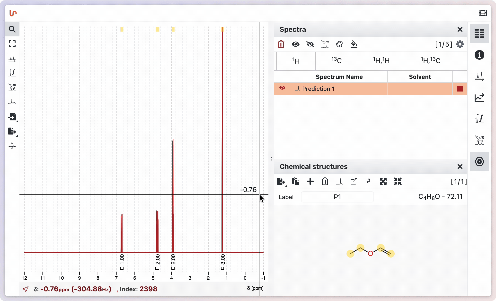

# Adding a chemical Structure

There are 3 ways to add a chemical structure in NMRium software: drag and drop a molfile, paste a molfile or SMILES, or edit the structure directly.

## Drag and drop a molfile

To import the structure, it must be saved as a molfile file. Drag and drop the molfile file into the workspace. The molecular structure, the molecular formula and the molecular mass are shown in the panel structures.

## Paste a molfile or a SMILES

You can paste a molfile or SMILES string directly into NMRium. Most major chemical drawing programs, such as ChemDraw, allow you to copy a structure as a molfile (for example, use "Copy As > Molfile" in ChemDraw). Simply copy the structure from your software and paste it by clicking on the corresponding icon.

## Edit the structure directly in NMRium

To edit an existing molecule, click on the molecule you want to modify. To create a new molecule, click in the empty space within the panel. A new window will open, allowing you to draw the molecular structure using the built-in editor. For detailed instructions on using the structure editor, refer to the "OCL Structure Editor" chapter. After drawing the molecule, click **Save**. The structure, along with its molecular formula and molecular mass, will appear in the Structures panel.

Once added, NMRium will calculate the molecular weight as well as the molecular formula. You can also edit the caption that will be displayed under the structure.

# Many chemical structures

NMRium allows you to manage multiple molecular structures within a single dataset. You can switch between different molecules using the arrow buttons located above the Chemical structures panel. Each molecule can be given a custom label for easy identification. Additionally, molecules can be set to "float" over the spectrum, making it easier to visually assign signals, especially when dealing with minor products or mixtures. This floating feature helps facilitate the assignment process by allowing you to overlay and compare structures directly with the spectral data.

# Predict spectra

It is possible to predict NMR spectra for a given molecular structure. To do this, draw a molecular structure or insert a molfile. Then click on the Predict spectra button in the Structures panel.

A window opens in which you can select the following settings:

- the frequency of the spectrometer
- the measuring range for both 1H and 13C in ppm
- the type of spectra to be predicted (1H, 13C, COSY, HSQC or HMBC)

You also need to specify the line width in Hz and the number of points. Before you are predicted the spectrum, you must agree that you are aware that the predicted spectra are not confidential by setting a check mark in the corresponding box. Then click on the Predict spectrum button.

The predicted spectrum is displayed on the workspace. You can hide it by opening the Spectra panel and clicking on the corresponding button. To show it again, click on the corresponding button once more.

You can analyse the predicted spectrum in the same way as a measured spectrum. You will find a proposed assignment in the Ranges panel and hover will highlight the atoms and corresponding ranges.

