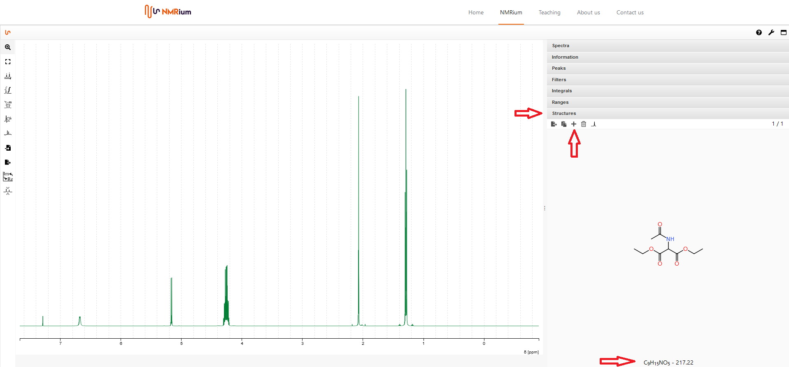
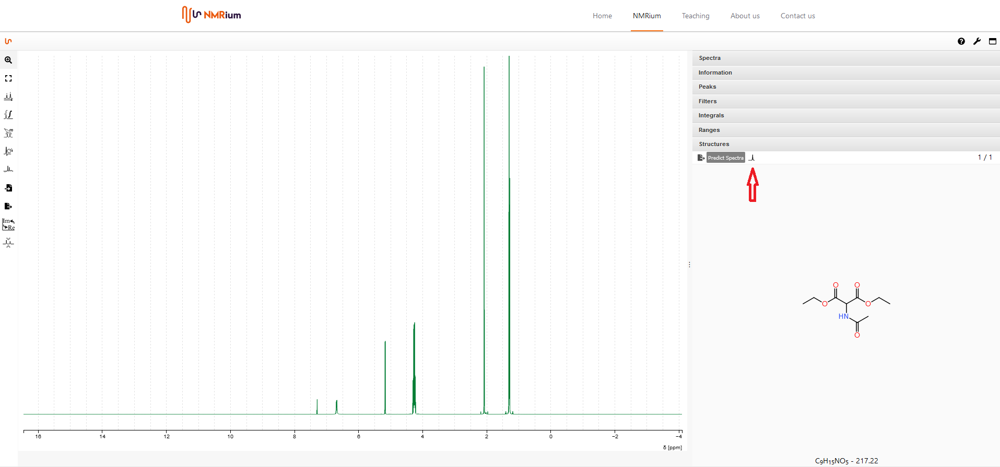
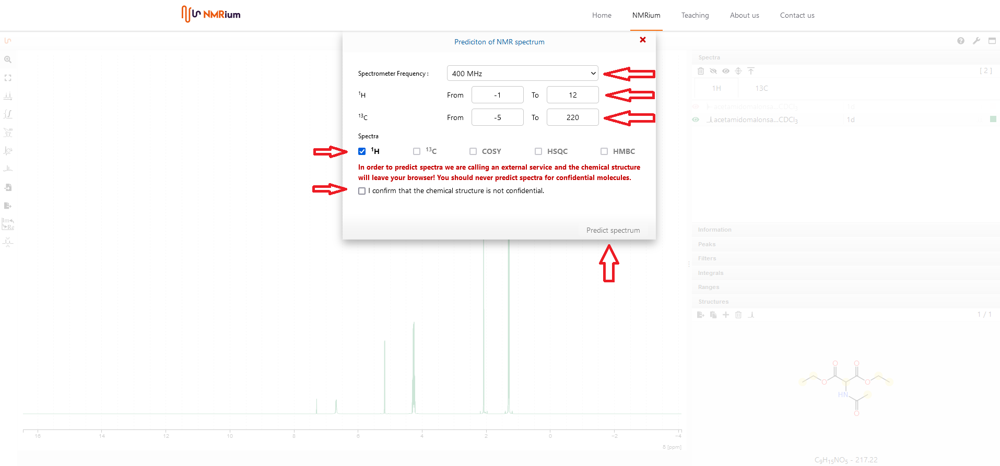
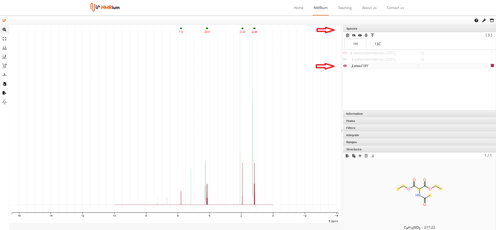

# Add a chemical Structure

You can insert a molecular structure by either drawing the structure or importing a mol file. In both cases, you first open the Structures panel. It is possible to add several structures to one set of spectra at the same time. Each individual structure can either be drawn or imported. To switch between structures, click on the arrow on the right side of the structures panel. On the right side of the panel, the number of stored spectra is given.

          
## Draw a chemical structure

To draw the molecular structure, click on the **+** button. 

          
A new window opens. Draw the molecular structure there. Then click on **save**. The structure is shown in the panel structures. The molecular formula and the molecular mass are also displayed.  

## Import a chemical structure

To import the structure, it must be saved as a mol file. Drag and drop the mol file into the workspace. The molecular structure, the molecular formula and the molecular mass are shown in the panel structures. 

## Change a chemical sturcture

If you want to change a molecular structure, double-click on it. A window opens. Modify the molecular structure there. Then click on Save. The corrected structure is shown in the panel structures. In addition, the corrected molecular formula and the corrected molecular mass are shown.  

## Delete a chemical structure

To delete a molecular structure, click on the trash button. The structure will be delete.

          
## Predict spectra

         

          

          
