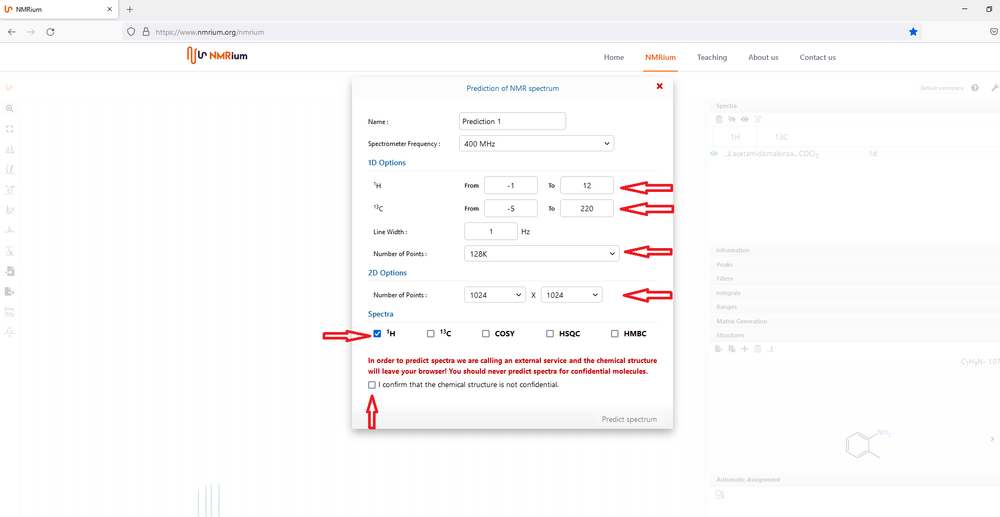
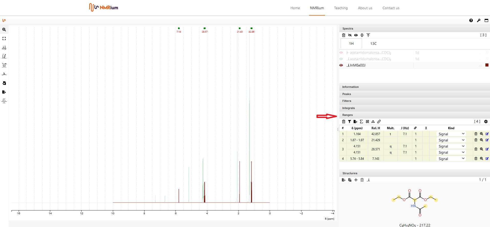

# Add a chemical Structure

You can insert a molecular structure by either drawing the structure or importing a mol file. In both cases, you first open the Structures panel. It is possible to add several structures to one set of spectra at the same time. Each individual structure can either be drawn or imported. To switch between structures, click on the arrow on the right side of the structures panel. On the right side of the panel, the number of stored spectra is given.

          
## Draw a chemical structure

To draw the molecular structure, click on the **+** button. 

          
A new window opens. Draw the molecular structure there. You can find a detailed explanation of the structure editor functions in the OCL structure Editor chapter. When you have drawn the molecule formula, click on **save**. The structure is shown in the panel structures. The molecular formula and the molecular mass are also displayed.  

## Import a chemical structure

To import the structure, it must be saved as a mol file. Drag and drop the mol file into the workspace. The molecular structure, the molecular formula and the molecular mass are shown in the panel structures. 

## Change a chemical sturcture

If you want to change a molecular structure, double-click on it. A window opens. Modify the molecular structure there. Then click on Save. The corrected structure is shown in the panel structures. In addition, the corrected molecular formula and the corrected molecular mass are shown.  

## Delete a chemical structure

To delete a molecular structure, click on the trash button. The structure will be delete.

          
## Predict spectra

It is possible to predict NMR spectra for a given molecular structure. To do this, draw a molecular structure or insert a molfile. Then click on the Predict spectra button in the Structures panel. 

   

A window opens in which you can select the following settings: 

* the frequency of the spectrometer
* the measuring range for both 1H and 13C in ppm
* the type of spectra to be predicted (1H, 13C, COSY, HSQC or HMBC)

You also need to specify the line width in Hz and the number of points. Before you are predicted the spectrum, you must agree that you are aware that the predicted spectra are not confidential by setting a check mark in the corresponding box. Then click on the Predict spectrum button. 

The predicted spectrum is displayed on the workspace. You can hide it by opening the Spectra panel and clicking on the corresponding button. To show it again, click on the corresponding button once more. 

          
You can analyse the predicted spectrum in the same way as a measured spectrum. You will find a proposed assignment in the Ranges panel.     

          
