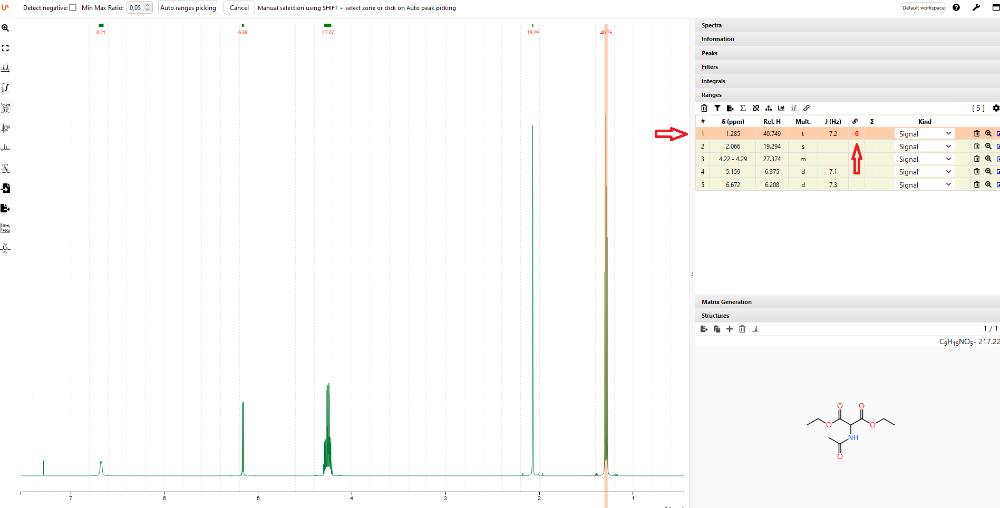
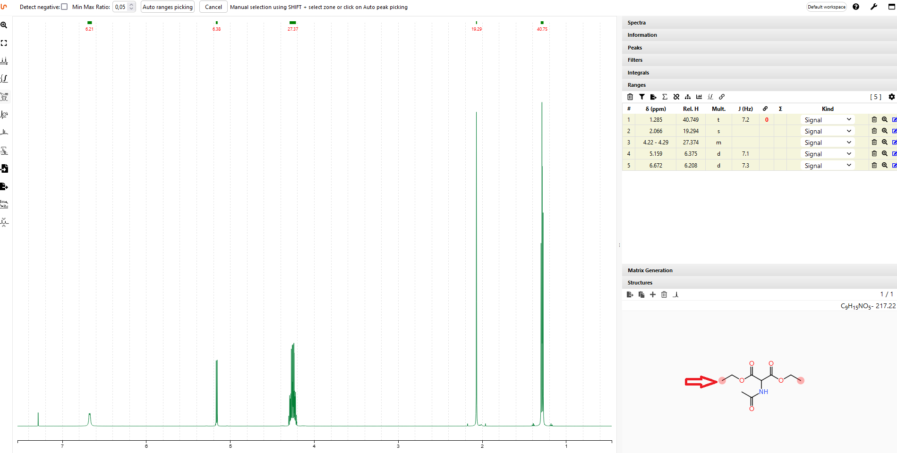
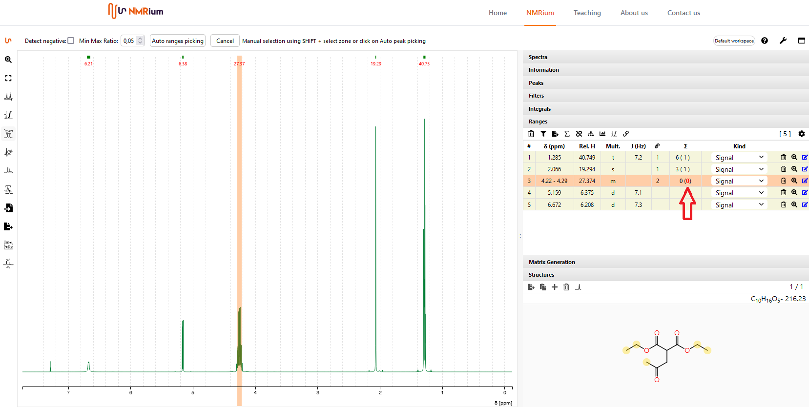
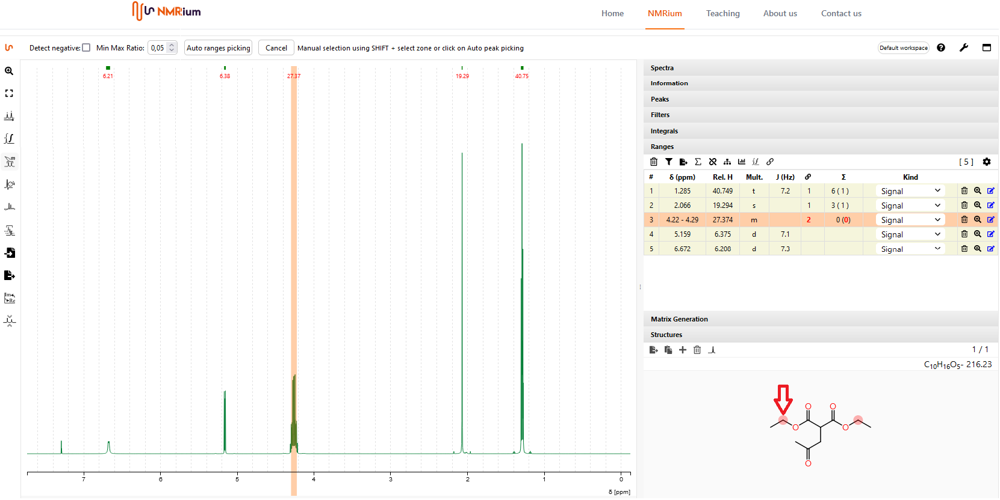

# Assign a Spectrum

To assign the signals of the spectrum to the atoms of a molecule, you must have determined the ranges (see chapter 1 D Spectra, Ranges). In addition, you must have defined a molecular structure in the panel Ranges. Open both panels. In the ranges panel, select a signal and click in the corresponding row in the assignment box.
A red zero appears.

Now click in the Structure panel on the atoms that correspond to the signal. When the cursor moves over a proton, a red ring is shown. 

Click on the proton belonging to the signal. You can assign several atoms at the same time. All atoms assigned to the signal are marked with a yellow ring. If you now click with the mouse us either over the signal in the workspace or over the row in the Ranges panel or over the assigned atoms in the structure, the assignment will be highlighted in orange in the workspace and in both panels. This allows you to assign all signals to the corresponding atoms in the structure. 

To determine the number of relative H-atoms, first click in the Ranges panel in the corresponding line in the box of the sum sign. 

Then click on the corresponding protons in the molecular structure in the Structures panel. In the panel Ranges the number of H-atoms determined automatically by NMRium is indicated in the corresponding line. 

