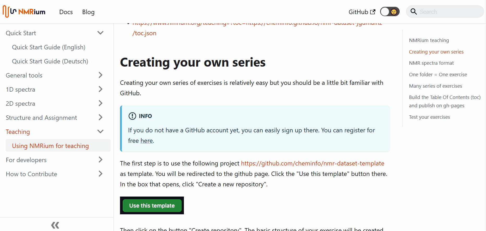
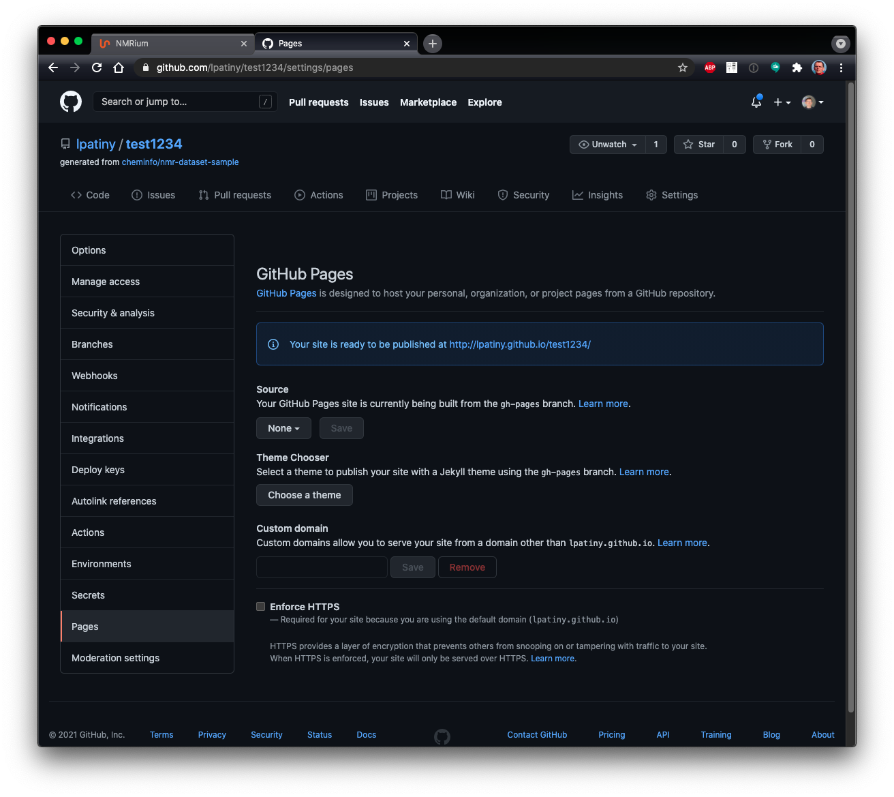

## NMRium teaching

NMRium is likely the best platform to teach structure elucidation to students. You may already have a look at series of exercises using the following links

- https://www.nmrium.org/teaching#?toc=https://cheminfo.github.io/nmr-dataset2/toc.json
- https://www.nmrium.org/teaching#?toc=https://cheminfo.github.io/nmr-dataset-nils/toc.json
- https://www.nmrium.org/teaching#?toc=https://cheminfo.github.io/nmr-dataset-jgumainz/toc.json

## Creating your own series

Creating your own series of exercises is relatively easy but you should be a little bit familiar with GitHub.

:::info 

If you do not have a GitHub account yet, you can easily sign up there. You can register for free [here](https://github.com/signup).

:::

The first step is to use the following project https://github.com/cheminfo/nmr-dataset-template as template. You will be redirected to the github page. Click the "Use this template" button there. In the box that opens, click "Create a new repository".

Then click on the button "Create repository". The basic structure of your exercise will be created. 

A GitHub page will open.  Click on the "Include all branches" box. You have to give your exercise a name, which you enter at "Repository name". You also have to select the setting "Public". Then click on the button "Create repository". The basic structure of your exercise will be created. Next, you need to create your own exercise.

:::info

To make changes to the repository created from the template, we recommend to work with the software **Visual Studio Code** which is available for free [here](https://code.visualstudio.com/). If you do not have this program installed on your computer, you can also work with the browser version. Open your repository on GitHub and press the `.` key on the keyboard. You will be automatically directed to the browser version of **Visual Studio Code**. It may take a few moments until all functions are usable. 

:::

GitHub has provided a basic structure for the exercise. 

You may then change all the files and folders (except the .github folder required to build the series). You have the possibility to group exercises in folders or have them directly at the first level.

:::info

If you want to create or rename folders, click the **Explorer** button on the menu bar on the left side of **Visual Studio Code**. To create a new folder, click the **New Folder** icon. Then label the folder and click the **Enter key**. To rename an existing folder, right-click on it. Click **Rename** in the opened box. Specify the new name and click the **Enter button**. To delete an existing folder, right-click on it. Click **Delete permanently** in the opened box. Than click **Delete** in the opening box.

To save the changes click the **Source control** button on the menu bar on the left. All the changes you have made are shown there. Write a short commit message in the **message** box. Then click the **check mark** above the box. The process may take a few minutes. Your changes will directly committed to the main branch on GitHub

:::

Now you need to switch back to the GitHub page. If you are using the browser version of the Visual Studio code, click the button at the top right. Click the "Switch to repository" button there. You will be redirected to GitHub. 

Now click on the "Settings" button in the bar at the top center. Then click the "Actions" button on the left side of the desktop, then go to Generals. You need to select the following settings:

- Allow all actions an resuable workflows
- Require approval for first-time contributs
- Read and Write permissions

For all three settings you have to click the respective "Save" button.
Now click the "Actions" button in the bar above the workspace, then click gh-pages deployment. On the right side of the workspace you will now find the button "Run workflow", which you also have to click. GitHub will now apply all the settings you have chosen and save them. This step may take a few minutes. You can perform all further steps, but you may not be able to view your correct exercises until a few minutes later (see last step).   

Now click the Code button in the upper left corner. You will be redirected to your exercise.  

Click on the Main button in the upper left corner and then on "gh-pages". Your exercise will be created.

In the "Readme.md" box at the bottom of the workspace, you can click the link to your exercises on GitHub or copy it and forward it to your students. Depending on the size of your created exercises, it may take a few minutes for NMRium to display the correct exercises.

## NMR spectra format

You should save the NMR spectra as a JCAMP-DX file (on topspin use the `tojdx` command). The spectrum should be FT and phase corrected. To spare bandwidth you may only save the real part of the spectrum.

## One folder = One exercise

:::info

There are three folder levels on **GitHub** or **Visual Studio Code** when building your own exercise series. The first level contains the `.github` folder and individual chapters for series of exercises (so call Table of Contents or tocs), e.g. Chapter 1 **Exercises for Beginners** and Chapter 2 **Exercises for Experts**. Each chapter contains second level folders. Here you can set up the different exercises (molecules). Each exercise contains on the third level one or more spectra and the corresponding molfile belonging to the molecule. You can add as many spectra to a molecule as you want. 

:::

For each exercise (second level) you want to create you can add the following files (third level):

- structure.mol : mandatory, the chemical structure of the answer
- 1h.jdx
- 13c.jdx
- 13cdec.jdx
- cosy.jdx
- hsqc.jdx
- hmbc.jdx
- deptXXX.jdx
- aptXXX.jdx
- ...

Only folders that contain an answer (file `structure.mol` as a molfile) will be processed.

By default we expect that those jcamps contains only the processed data. If you would like to provide FID or FID + FT data please use the following convention:

- 1h.fid.jdx
- 1h.full.jdx

## Many series of exercises

While the action will generate a Table Of Contents (toc) for all the exercises, on toc is also generated per folder.

https://www.nmrium.org/teaching#?toc=https://cheminfo.github.io/nmr-dataset-template/toc_10_First.json

The name of the toc for each folder is `toc_ABCD.json` in which ABCD is the name of the folder. Only the folder present at the first level are considered.

## Test your exercises

https://www.nmrium.org/teaching#?toc=https://cheminfo.github.io/nmr-dataset-template/toc.json

In order to find the URL of your repository you should open the settings of your project and click on the left on `Pages`. You will then see the URL on which the data are published.

:::tip Technical information

Technically there is a GitHub action (present in `.github/deploy/workflow.yml`) that will add various JSON files containing the list of exercises, calculate the molecular formula and generate a secret key corresponding to the answer. This action will publish your website on a branch `gh-pages` that is publicly available on the internet.

:::

