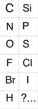
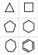
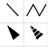
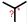
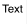

## OpenChemLib Chemical Editor Concepts

The structure editor is used to draw chemical molecules, substructure fragments, reactions and simple drawing objects like text, boxes, etc. Its functionality changes depending on the kind of object\(s\) being edited. Thus, the atom mapping tool is only available, when a reaction is edited. Query feature dialogs only open, when a substructure is edited, etc.

### Atom and Bond Hot-Keys

Hot-keys allow to quickly change atom and bond types. When the mouse is moved over an atom or bond then the atom or bond is automatically highlighted, indicating that mouse clicks or pressing a hot-key affect the highlighted object.

| Hot-Key              | Type                | Name                 | Explanation                                                                                                                                                                              |
| :------------------- | :------------------ | :------------------- | :--------------------------------------------------------------------------------------------------------------------------------------------------------------------------------------- |
| **'Delete'**         | Atoms Bonds Mapping | Delete               | Deletes highlighted and selected atoms and bonds. When a reaction is edited and the mapping tool is selected, then pressing the 'Delete' key removes all atom mapping from the reaction. |
| **'1','2','3', ...** | Atom                | Atom Chain           | Attaches a chain of 'n' carbon atoms to the highlighted atom provided that its valence maximum is not exceeded.                                                                          |
| **'a','b','c', ...** | Atom                | Atom Symbol          | Changes the symbol of the highlighted atom according to the typed sequence of atoms. E.g. typing 'n' followed by 'a' converts the atom to a sodium atom.                                 |
| **'+', '-'**         | Atom                | Charge Modifiers     | Increases or decreases the charge of the highlighted atom.                                                                                                                               |
| **'?'**              | Atom                | Connection Point     | Converts an atom into a connection point of a substituent or building block.                                                                                                             |
| **'q'**              | Atom, Bond          | Query Feature Dialog | If a substructure query is edited then this key opens a query feature dialog, which allows to specify additional atom/bond conditions for the substructure search.                       |
| **'1','2','3'**      | Bond                | Bond Order           | Changes the highlighted bond into a single, double or triple bond.                                                                                                                       |
| **'u'**              | Bond                | Up Bond              | Changes the highlighted bond into 'up' stereo bond, if at least one of the associated atoms is a relative or absolute stereo center.                                                     |
| **'d'**              | Bond                | Down Bond            | Changes the highlighted bond into 'down' stereo bond, if at least one of the associated atoms is a relative or absolute stereo center.                                                   |
| **'c'**              | Bond                | Cross Bond           | Changes the highlighted bond into a double bond with unknown configuration.                                                                                                              |
| **'4','5','6','7'**  | Bond                | Annelate Ring        | Annellates a new saturated ring with the respective ring size to the highlighted bond.                                                                                                   |
| **'b'**              | Bond                | Annelate Benzo       | Annellates a new benzene ring to the highlighted bond.                                                                                                                                   |

### Buttons and Tools

Chemical structures are drawn by selecting an appropriate tool and applying it while moving, clicking and dragging the mouse pointer over the drawing area. While the selection of a tool has no immediate effect on the drawn structure, pressing a button does. Currently available buttons allow to clean up atom coordinates or to revert the most recent structure change.

| Button or Tool                               | Name                       | Explanation                                                                                                                                                                                                                                                                                                                                                                                                                                                                                                                                                                                                                                                                                                                                                                                                                                                                                                                                                                                                                                                                                                                                                                                                                                                                                                                                                                                                                                                  |
| :------------------------------------------- | :------------------------- | :----------------------------------------------------------------------------------------------------------------------------------------------------------------------------------------------------------------------------------------------------------------------------------------------------------------------------------------------------------------------------------------------------------------------------------------------------------------------------------------------------------------------------------------------------------------------------------------------------------------------------------------------------------------------------------------------------------------------------------------------------------------------------------------------------------------------------------------------------------------------------------------------------------------------------------------------------------------------------------------------------------------------------------------------------------------------------------------------------------------------------------------------------------------------------------------------------------------------------------------------------------------------------------------------------------------------------------------------------------------------------------------------------------------------------------------------------------- |
|                 | Atom Tools                 | The Atom Tools cover atoms frequently used in organic chemistry. After selecting one of these tools, you may place new atoms by clicking into the empty space or change existing atom by clicking onto them.                                                                                                                                                                                                                                                                                                                                                                                                                                                                                                                                                                                                                                                                                                                                                                                                                                                                                                                                                                                                                                                                                                                                                                                                                                                 |
|             | Atom Detail Tool           | Double clicking an atom with this tool selected will open a dialog window for specifying an unusual atom label, specific isotop, abnormal valence and/or radical state. When closing the dialog the double clicked atom is changed accordingly. The dialog settings are remembered applied to any other clicked atom, as long as the tool is selected.                                                                                                                                                                                                                                                                                                                                                                                                                                                                                                                                                                                                                                                                                                                                                                                                                                                                                                                                                                                                                                                                                                       |
|               | Charge Tools               | These tools let you assign charges to atoms. Multiple clicks on the same atom will increase or decrease the charge by 1. The **Osiris Structure Editor** assumes the presence of implicit hydrogens at any charged or non charged atoms to meet the atom's default valence. However, implicit hydrogens are only shown on hetero atoms.                                                                                                                                                                                                                                                                                                                                                                                                                                                                                                                                                                                                                                                                                                                                                                                                                                                                                                                                                                                                                                                                                                                      |
|                 | Ring Tools                 | After selecting one of the predefined rings, one may create a new ring or attach a ring to an existing bond or atom to create annelated ring systems or a spiro compound, respectively.                                                                                                                                                                                                                                                                                                                                                                                                                                                                                                                                                                                                                                                                                                                                                                                                                                                                                                                                                                                                                                                                                                                                                                                                                                                                      |
|                 | Bond Tools                 | Bond Tools allow you to create new bonds and to change existing bonds concerning their order or stereo-orientation. By clicking into the open space you create a new bond of the selected type including two carbon atoms. Clicking onto an existing atom will attach a new carbon. Dragging the mouse from one atom to another one will just connect these atoms or increment the bond order between them, if they were already connected. If the plain single bond tool is selected, bonds may be multiply clicked to cycle through the possible bond orders. Where reasonable, it also toggles between double bonds with known or unknown configuration, the so-called cross bond. When using stereo bonds please consider that the pointed tip of the bond should always point to the stereo center.                                                                                                                                                                                                                                                                                                                                                                                                                                                                                                                                                                                                                                                     |
|                 | Chain Tool                 | The Chain Tool provides the fastest way to draw aliphatic carbon chains in zig-zag orientation. With the selected Chain Tool click into the empty space or at an existing atom and drag the mouse to create a new zig-zag chain and flip its orientation.                                                                                                                                                                                                                                                                                                                                                                                                                                                                                                                                                                                                                                                                                                                                                                                                                                                                                                                                                                                                                                                                                                                                                                                                    |
|                  | ESR Tools                  | The editor supports the enhanced stereo recognition \(ESR\) introduced by Molecular Design Ltd. with IsisDraw V2.5. The ESR Tools allow to define for every stereo center, whether it is an absolute one or if it belongs to a group of stereo centers that have the drawn, but relative configuration. For any group of relative stereo centers one may define that the drawn **and** the inverse configurations are present, i.e. that we have a racemic situation concerning the group members. This is indicated by green stereo bonds and an ampersand '**&**' at the stereo centers. Likewise one may define groups of relative stereo centers that contain either the drawn configuration **or** the opposite one. Stereo centers of such a group are indicated by blue stereo bonds and the word '**or**' at the stereo centers. In addition to the '**&**' or '**or**' indicators group numbers show which stereo centers belong to the same group.                                                                                                                                                                                                                                                                                                                                                                                                                                                                                                 |
|  | Unknown Configuration Tool | This symbol is used to denote an unknown stereo configuration at a chiral center.                                                                                                                                                                                                                                                                                                                                                                                                                                                                                                                                                                                                                                                                                                                                                                                                                                                                                                                                                                                                                                                                                                                                                                                                                                                                                                                                                                            |
|             | Cleanup Button             | A cleanup will generate new coordinates of an existing molecule. It rearranges bond and atom positions in order to have a proper 2D structure. If a part of the molecule or reaction is selected, the cleanup will retain the relative orientation of the non-selected atoms.                                                                                                                                                                                                                                                                                                                                                                                                                                                                                                                                                                                                                                                                                                                                                                                                                                                                                                                                                                                                                                                                                                                                                                                |
|          | Lasso Pointer Tool         | This tools allows you to select multiple atoms and bonds to rearrange, rotate, resize, delete or duplicate at the same time. Just drag the mouse pointer around the atoms of interest. Selected atoms and bonds are shown in red. By pressing the control key you switch to the rectangular selection mode and the shift key lets you add atoms to the current selection. By clicking onto an atom or bonds and dragging the mouse one may more it or all selected atoms, if the clicked one is selected. When pressing the shift key while dragging a selected fragment, an automatically created copy of the selected fragment is dragged. Where the editor needs to support multiple molecules, e.g. if a reaction is edited, then every reactant and product is indicated by a large light gray indicator in the background \('A', 'B', 'P1', etc.\). Where independent fragments shall be treated as one molecule, e.g. anion and kation of one salt, one must locate those fragments close enough that there is only one indicator behind them. If a reaction or molecule query is edited, then one may double click an atom or a set of selected atoms to open a query feature dialog to specify additional conditions for a fragment to match in a substructure search. The same applies to individual or multiple selected bonds. If the edited object is not a query then double clicking of an atom or bond will just select the entire fragment. |
|                | Delete Tool                | It allows you to delete individual atoms or bonds or selected parts of the molecule. Selected areas may also be removed by pressing the delete key from the keyboard.                                                                                                                                                                                                                                                                                                                                                                                                                                                                                                                                                                                                                                                                                                                                                                                                                                                                                                                                                                                                                                                                                                                                                                                                                                                                                        |
|         | Zoom and Rotate Tool       | This tool allows to zoom or rotate the entire drawing or a selected subset. Just click at the intended origin for the rotation or zooming and drag the mouse vertically to zoom or horizontically to rotate.                                                                                                                                                                                                                                                                                                                                                                                                                                                                                                                                                                                                                                                                                                                                                                                                                                                                                                                                                                                                                                                                                                                                                                                                                                                 |
|               | Mapping Tool               | This tool is only available when a reaction is edited. Use this tool to map reactant atoms to the respective product atoms. This is done by clicking on a reactant atom and dragging the mouse onto the corresponding product atom. The editor will acknowledge the link by displaying a red mapping number at both atoms. Afterwards it tries to map atoms in the vicinity automatically and displays green numbers at automatically mapped atoms. Please assign manually as many reactant-product pairs as are needed that the entire reaction is mapped completely and correctly. Pressing the 'Delete' key while this tool is selected removes all mapping from the reaction.                                                                                                                                                                                                                                                                                                                                                                                                                                                                                                                                                                                                                                                                                                                                                                            |
|                  | Text Tool                  | The text tool may only be selected in certain situations. If it is selected one may use it to place text elements directly into the drawing. These text elements will be integral part of the drawing and, thus, move, resize and rotate with the molecules or reaction.                                                                                                                                                                                                                                                                                                                                                                                                                                                                                                                                                                                                                                                                                                                                                                                                                                                                                                                                                                                                                                                                                                                                                                                     |
