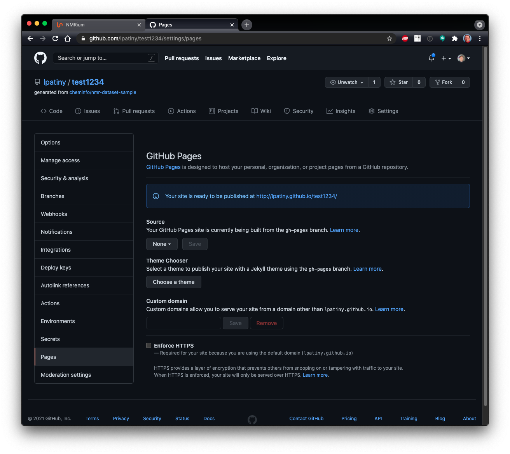

## NMRium teaching

NMRium is likely the best platform to teach structure elucidation to students. You may already have a look at series of exercises using the following links

- https://www.nmrium.org/teaching#?toc=https://cheminfo.github.io/nmr-dataset2/toc.json
- https://www.nmrium.org/teaching#?toc=https://cheminfo.github.io/nmr-dataset-nils/toc.json
- https://www.nmrium.org/teaching#?toc=https://cheminfo.github.io/nmr-dataset-jgumainz/toc.json

## Creating your own series

Creating your own series of exercises is relatively easy but you should be a little bit familiar with GitHub.

:::info 

If you don't have a Github account yet, you can easily sign up there. Follow the link below: 
https://github.com/ 
and sign up. 

:::

The first step is to use the following project https://github.com/cheminfo/nmr-dataset-template as template.

This is achieved by visiting the webpage and clicking on the corresponding button.

:::info 

Select the **Public** setting.  Until the exercise is published, only you and the NMRium developers can see the exercise you created. If you choose the **Private** setting, you must change your setting to **Public** before publishing. 

:::

You may then change all the files and folders (except the .github folder required to build the series). You have the possibility to group exercises in folders or have them directly at the first level.

:::info

To make changes to the template, it is best to work with the software **Visual Studio Code**. If you do not have this program installed on your computer, you can also work with the browser version. Open the template on github. Then press the dot key on the keyboard. You will be automatically directed to the browser version of **Visual Studio Code**. It may take a few minutes until all functions are usable. 

:::

:::info

If you want to create or rename folders, click the **Explorer** button on the menu bar on the left side of the **Visual Studio Code** program. To create a new folder, click the **New Folder** icon. Then label the folder and click the **Enter key**. To rename an existing folder, right-click on it. Click **Rename** in the opened box. Specify the new name and click the **Enter button**.

To save the changes click the **Source control** button on the menu bar on the left. All the changes you have made are shown there. Write a short commit in the **message** box. Then click the **check mark** above the box. The process may take a few minutes. Your changes will directly committed to the master branch on Github

:::

## NMR spectra format

You should save the NMR spectra as a JCAMP-DX file (on topspin use the `tojdx` command). The spectrum should be FT and phase corrected. To spare bandwidth you may only save the real part of the spectrum.

## One folder = One exercise

For each exercise you want to create you can add the following files:

- structure.mol : mandatory, the chemical structure of the answer
- 1h.jdx
- 13c.jdx
- 13cdec.jdx
- cosy.jdx
- hsqc.jdx
- hmbc.jdx
- deptXXX.jdx
- aptXXX.jdx
- ...

Only folders that contain an answer (file `structure.mol` as a molfile) will be processed.

By default we expect that those jcamps contains only the processed data. If you would like to provide FID or FID + FT data please use the following convention:

- 1h.fid.jdx
- 1h.full.jdx

## Build the toc and publish on gh-pages

The system is based on various JSON files that are build automatically thanks to a github action. This will be done automatically but you should check that

## Test your exercises

https://www.nmrium.org/teaching#?toc=https://cheminfo.github.io/nmr-dataset-template/toc.json

In order to find the URL of your repository you should open the settings of your project and click on the left on `Pages`. You will then see the URL on which the data are published.

:::tip Technical information

Technically there is a GitHub action (present in `.github/deploy/workflow.yml`) that will add various JSON files containing the list of exercises, calculate the molecular formula and generate a secret key corresponding to the answer. This action will publish your website on a branch `gh-pages` that is publicly available on the internet.

:::

## Many series of exercises

While the action will generate a Table Of Contents (toc) for all the exercises, on toc is also generated per folder.

https://www.nmrium.org/teaching#?toc=https://cheminfo.github.io/nmr-dataset-template/toc_10_First.json

The name of the toc for each folder is `toc_ABCD.json` in which ABCD is the name of the folder. Only the folder present at the first level are considered.
