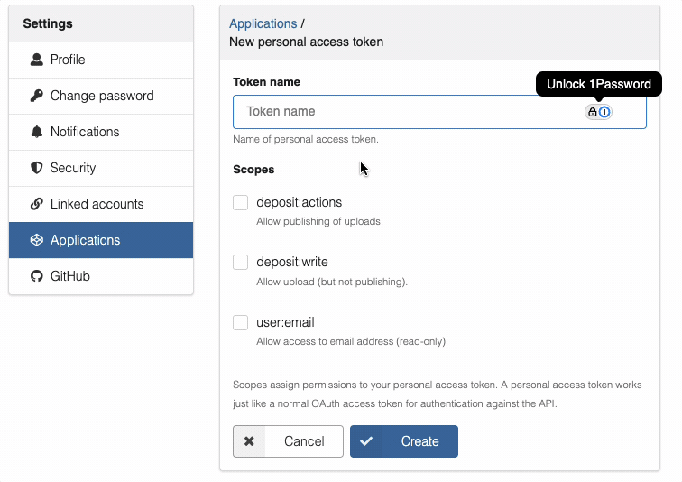

import NMRiumYamlEditor from './NMRiumYamlEditor';

:::caution Experimental feature

Submitting data to Zenodo is still an experimental feature. Please test it **in the sandbox** and share your feedback on https://www.nmrium.com/contact.

Visit the [NMRium dataset on Zenodo](https://zenodo.org/search?q=metadata.subjects.subject%3A%22NMRium%20dataset%22&l=list&p=1&s=10&sort=bestmatch) to browse submitted datasets.

You may also check the [NMRium dataset in the sandbox](https://sandbox.zenodo.org/search?q=metadata.subjects.subject%3A%22NMRium%20dataset%22&l=list&p=1&s=50&sort=bestmatch) but don't forget they may deleted anytime.

:::

Submit NMR spectra to Zenodo with direct integration into NMRium for interactive visualization and analysis. This tool enables the ultimate **FAIR data submission** for NMR datasets, making your research data Findable, Accessible, Interoperable, and Reusable.

## About

`zenodo-nmrium` is a command-line tool designed to streamline the submission of NMR spectra datasets to Zenodo while leveraging the power of [NMRium](https://www.nmrium.org) for interactive, web-based visualization.

### Why FAIR Data Matters

This tool ensures your NMR data follows FAIR principles:

- **Findable**: Your data is registered and discoverable on Zenodo
- **Accessible**: Data is freely available on the public internet
- **Interoperable**: Data is stored as a zip file that contains the original NMR data that work with NMRium and other tools
- **Reusable**: Rich metadata and open licenses facilitate reuse by others

### The Ultimate Goal

`zenodo-nmrium` enables a complete FAIR data workflow:

1. **Organize your data**: Package each NMR sample in a folder or as a `.nmrium.zip` file
2. **Store in Zenodo**: Upload your data to Zenodo (sandbox for testing, production for publication)
3. **Interactive visualization**: All data is directly accessible from Zenodo and can be viewed interactively in NMRium
4. **Table of contents**: Navigate between multiple samples through a structured table of contents
5. **Community sharing**: Join the NMRium community on Zenodo to discover and access all community-submitted datasets

## Installation

### Option 1: Pre-built Binaries

Pre-built binaries are available for macOS ARM64 and Linux x64. This option is useful if you **don't have Node.js installed** and are working on macOS ARM64 (Apple Silicon) or Linux Intel (x64).

#### macOS ARM64 (Apple Silicon)

```bash
curl -o zenodo-nmrium https://www.lactame.com/lib/zenodo-nmrium/HEAD/zenodo-nmrium-darwin-arm64 && chmod 555 zenodo-nmrium
```

Then use it:

```bash
./zenodo-nmrium <path> [options]
```

#### Linux x64 (Intel)

```bash
curl -o zenodo-nmrium https://www.lactame.com/lib/zenodo-nmrium/HEAD/zenodo-nmrium-linux-x64 && chmod 555 zenodo-nmrium
```

Then use it:

```bash
./zenodo-nmrium <path> [options]
```

#### Other Platforms

For other platforms (Windows, macOS Intel, ARM Linux, etc.), use Option 2 (npm) instead.

### Option 2: npm Package

If you have [Node.js](https://nodejs.org/) installed, you can use the npm package.

#### Using npx (Recommended - No Installation Required)

```bash
npx zenodo-nmrium <path> [options]
```

This downloads and runs the latest version without installing anything.

#### Global Installation

```bash
npm install -g zenodo-nmrium
```

Then use it:

```bash
zenodo-nmrium <path> [options]
```

## Quick Start

### 1. Organize Your Data

Create a folder with the following structure:

- **One folder or `.nmrium.zip` file per item** in your menu/table of contents
- Each folder/ZIP should contain all NMR data for a sample or group of samples
- One `index.yml` metadata file at the root describing your entire dataset

Example folder structure:

```
my-nmr-dataset/
├── index.yml                    # Dataset metadata (required)
├── sample_1/                    # First sample (name will be reused in the table of content)
│   ├── structure.mol            # Optional: chemical structure file (molfile format)
│   ├── 12/                      # Experiment number of a native Bruker folder
│   │   ├── fid
│   │   ├── acqu
│   │   ├── acqus
│   │   ├── pdata/               # Processed data folder
│   │   │   └── 1/
│   │   │       ├── proc
│   │   │       ├── procs
│   │   │       └── ...
│   │   └── ...
│   ├── 13/                      # Another experiment
│   └── ...
├── sample_2.nmrium.zip          # Second sample was processed using NMRium. It could contain assignment
├── sample_3/
│   ├── structure.mol            # Optional: chemical structure file (molfile format)
│   └── spectrum.jdx             # JCAMP-DX file (e.g., exported from Topspin using `tojdx` or from MNova with peak assignments)
└── ...
```

:::tip Chemical structure files

Each sample folder may optionally contain a `structure.mol` file (MOL format) if the chemical structure is known. This allows NMRium to display and analyze the structure alongside the NMR spectra.

:::

### 2. Create the Metadata File (index.yml)

The `index.yml` file is required and should be placed at the root of your dataset folder. It contains metadata about your entire dataset.

:::tip

You can use the interactive editor below to tweak the example metadata and validate the YAML syntax.

:::

<NMRiumYamlEditor />

#### Metadata Fields

| Field         | Type          | Required | Description                                                |
| ------------- | ------------- | -------- | ---------------------------------------------------------- |
| `title`       | String        | Yes      | Title of your NMR dataset                                  |
| `description` | String (HTML) | Yes      | Dataset description as a string in HTML format             |
| `copyright`   | String        | Yes      | License identifier (default: `cc-by-4.0`, e.g., `cc0-1.0`) |
| `keywords`    | Array         | No       | List of keywords for dataset discoverability               |
| `authors`     | Array         | Yes      | List of dataset authors                                    |

#### Author Fields

| Field         | Type   | Required | Description                                             |
| ------------- | ------ | -------- | ------------------------------------------------------- |
| `family-name` | String | Yes      | Author's surname                                        |
| `given-name`  | String | Yes      | Author's first name                                     |
| `affiliation` | String | No       | Author's institutional affiliation                      |
| `orcid`       | String | No       | Author's ORCID identifier (format: 0000-0000-0000-0000) |

### 3. Get a Zenodo API Token

- **Sandbox (testing)**: https://sandbox.zenodo.org/account/settings/applications/tokens/new/
- **Production**: https://zenodo.org/account/settings/applications/tokens/new/

You must enable `deposit:action` and `deposit:write` permissions when creating the token.



:::tip Different tokens

Sandbox and production tokens are always different. You will only see this token once, so save it in a secure location.

:::

#### Providing the Token

You can provide your Zenodo API tokens in two ways:

**Option 1: Command Line**

Pass the token directly via the `-t` or `--access-token` option:

```bash
./zenodo-nmrium ./my-nmr-dataset -t YOUR_SANDBOX_TOKEN
```

**Option 2: Environment Variables (.env file)**

Store your tokens in a `.env` file. The tool will look for this file in one of three locations (in order):

1. `.env` in the current working directory
2. `.zenodo-nmrium` in your home directory (`~/.zenodo-nmrium`)
3. `.env` in your home directory (`~/.env`)

Create a `.env` file with the following environment variables:

```env
ACCESS_TOKEN=<ZENODO_PRODUCTION_TOKEN>
ACCESS_TOKEN_SANDBOX=<ZENODO_SANDBOX_TOKEN>
```

:::warning Different tokens for environments

You **must** use two different tokens:

- `ACCESS_TOKEN` for production submissions (`-p` flag)
- `ACCESS_TOKEN_SANDBOX` for sandbox submissions (default or `-s` flag)

Using the wrong token for the environment will fail!

:::

Example `.env` file:

```env
# Zenodo production token
# Generated from: https://zenodo.org/account/settings/applications/tokens/new/
ACCESS_TOKEN=your_production_token_here

# Zenodo sandbox token
# Generated from: https://sandbox.zenodo.org/account/settings/applications/tokens/new/
ACCESS_TOKEN_SANDBOX=your_sandbox_token_here
```

When using environment variables, you can omit the `-t` option:

```bash
# Uses ACCESS_TOKEN_SANDBOX from .env file
./zenodo-nmrium ./my-nmr-dataset

# Uses ACCESS_TOKEN from .env file
./zenodo-nmrium ./my-nmr-dataset -p
```

### 4. Submit Your Data

#### Basic submission to sandbox:

```bash
./zenodo-nmrium ./my-nmr-dataset -t YOUR_SANDBOX_TOKEN
```

#### Auto-publish after submission:

```bash
./zenodo-nmrium ./my-nmr-dataset -t YOUR_SANDBOX_TOKEN -a
```

#### Submit to production:

```bash
./zenodo-nmrium ./my-nmr-dataset -t YOUR_PRODUCTION_TOKEN -p
```

#### Combine options:

```bash
./zenodo-nmrium ./my-nmr-dataset --access-token YOUR_TOKEN --production --auto-publish
```

:::tip Remember
Use your sandbox token for testing and your production token for final submission. These tokens are different and cannot be used interchangeably.
:::

## Command Options

```
Usage: zenodo-submit <path> [options]

Positional Arguments:
  path                                    Path to dataset folder with index.yml and data

Options:
  -t, --access-token <token>              Zenodo API access token (required)
  -s, --sandbox                           Use sandbox environment (default)
  -p, --production                        Use production environment
  -a, --auto-publish                      Auto-publish after submission
  -d, --data-selection <type>             Data selection for NMRium visualization
                                          Choices: ft, fid, both, preferFT, preferFID
                                          Default: ft
  -l, --log-level <level>                 Logger level
                                          Choices: trace, debug, info, warn, error, fatal, silent
                                          Default: info
  -h, --help                              Show this help message
```

### Option Details

#### Positional Argument: path (Required)

- **Description**: Path to your dataset folder
- **Contains**: `index.yml` file and NMR data folders/ZIPs
- **Example**: `./my-nmr-dataset`, `/Users/username/data/spectra`

#### Access Token (-t, --access-token)

- **Description**: API token for authentication with Zenodo
- **Required?** Yes, either via `-t` option or environment variables (`ACCESS_TOKEN` or `ACCESS_TOKEN_SANDBOX`)
- **How to get**:
  1. Log in to Zenodo (sandbox or production)
  2. Go to Account → Settings → Applications → Personal access tokens
  3. Click "New token"
  4. Give it a name (e.g., "NMRium submission")
  5. Select the required scopes: `deposit:action` and `deposit:write`
  6. Click "Create" to generate the token
  7. Copy the token
- **Important**:
  - Sandbox and production will have different tokens
  - Keep tokens private and secure
  - Never commit tokens to version control
  - Ensure your token has `deposit:action` and `deposit:write` permissions
- **Usage**:
  - Command line: `-t YOUR_TOKEN` or `--access-token YOUR_TOKEN`
  - Environment: Set `ACCESS_TOKEN` or `ACCESS_TOKEN_SANDBOX` in a `.env` file

#### Environment (-s, --sandbox | -p, --production)

- **Default**: Sandbox (if neither `-s` nor `-p` is specified, data will be submitted to sandbox)
- **Usage**:
  - `-s` or no flag: Submit to Zenodo sandbox (test environment)
  - `-p`: Submit to production environment (public, permanent)
- **Important**: Cannot use both `-s` and `-p` simultaneously
- **Workflow**: Test in sandbox first, then use `-p` for production

**Sandbox vs. Production**:

| Aspect          | Sandbox                    | Production         |
| --------------- | -------------------------- | ------------------ |
| Purpose         | Testing and development    | Final publication  |
| Data retention  | Cleaned periodically       | Permanent          |
| Public access   | Limited                    | Full public access |
| DOI             | Sandbox DOI                | Permanent DOI      |
| Recommended for | First submissions, testing | Final datasets     |

#### Auto-publish (-a, --auto-publish)

- **Description**: Automatically publish the record after submission
- **Behavior**:
  - Without `-a`: Record created in draft state (you can review before publishing)
  - With `-a`: Record immediately published and public
- **Usage**: `-a` or `--auto-publish` (no value needed)
- **Recommendation**:
  - Omit for first submission (review before publishing)
  - Use `-a` for batch submissions after testing

#### Data Selection (-d, --data-selection)

- **Description**: Controls which NMR data types are shown in NMRium
- **Choices**:
  - `ft`: Show only processed (Fourier Transform) spectra (default)
  - `fid`: Show only raw FID data
  - `both`: Show both processed and FID
  - `preferFT`: If both FID and processed are available, show processed
  - `preferFID`: If both FID and processed are available, show FID

- **Default**: `ft`
- **Usage**: `-d ft`, `--data-selection both`
- **Example**: For comparing raw and processed data: `-d both`

#### Log Level (-l, --log-level)

- **Description**: Sets the verbosity level of the logger output
- **Choices**:
  - `trace`: Most verbose; logs detailed execution trace information
  - `debug`: Logs debugging information and variable values
  - `info`: Standard logging level (recommended); logs important information (default)
  - `warn`: Logs warnings and errors only
  - `error`: Logs errors only
  - `fatal`: Logs only fatal errors
  - `silent`: No output at all

- **Default**: `info`
- **Usage**: `-l debug`, `--log-level warn`
- **Example**: For detailed debugging: `-l debug` or `-l trace`
- **Recommendation**:
  - Use `info` (default) for normal submissions
  - Use `debug` or `trace` when troubleshooting issues
  - Use `warn` or `silent` for batch operations to reduce output

Visit the [NMRium dataset on Zenodo](https://zenodo.org/search?q=metadata.subjects.subject%3A%22NMRium%20dataset%22&l=list&p=1&s=50&sort=bestmatch) to browse submitted datasets.
