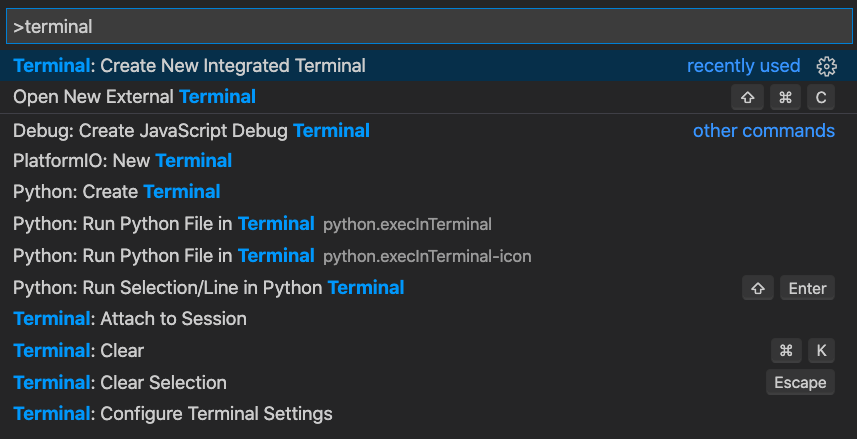

The documentation of NMRium is present on GitHub and the simplest way to correct or improve the text is to directly edit the file on 'GitHub'.

If you want to get involved more deeply in the update of the documentation it is better to have a local copy of the repository on your computer.

## Step 1: Install all the requires softwares

## Step 2: Clone the project

## Step 3: Start your Docusaurus site

From vscode open a terminal <kbd>CTRL</kbd><kbd>SHIFT</kbd><kbd>P</kbd> to search for all the possible command and enter `terminal` as search string.



Run the development server by typing:

```shell
npm run start
```

You can now previsualize your website from the browser at the following URL: `http://localhost:3000`.
