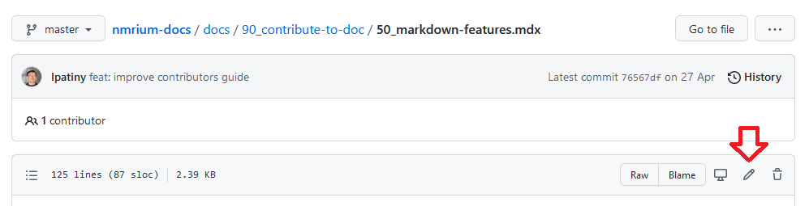

All contents of the documentation are hosted on GitHub. In order to contribute to the documentation, all you need is a GitHub account. You can register for free [here](https://github.com/signup).

Then follow these steps:

## 1. Fork our repository

In order to contribute, you do not need any access rights to the repository. You can simply create your own working copy by **forking** the repository. To do so, please visit our GitHub repository:

https://github.com/cheminfo/nmrium-docs

Then, click the **Fork** button in the upper right corner of the window:

## 2. Edit and commit

Once you have created your fork of the repository, you can start editing the pages on your fork. All pages are written in **Markdown**, a very simple format allowing you to include formatting, links, images, and more to your text. A good overview of formatting options is on [this page](docs/90_contribute-to-doc/50_markdown_features/50_markdown-features.mdx).

To **edit** a page, you can simply navigate to the page and click the **pencil button**:

To save the changes to the forked repository, you have to issue a **commit** (which is the equivalent of saving changes in GitHub). In the web interface, you can use the commit section at the bottom. In order to commit changes, you have to leave a short commit message:

## 3. Create a pull request