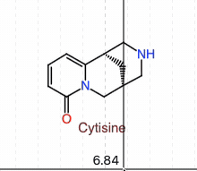
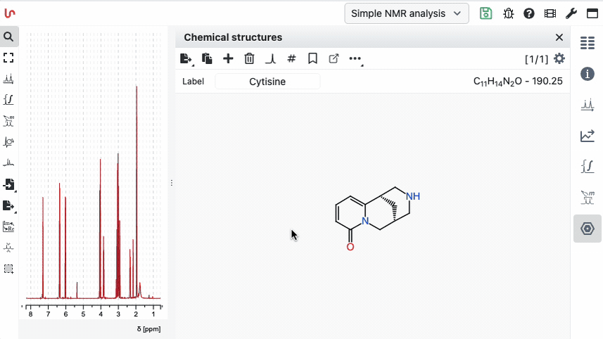

# How can I hide the molecule label?

In earlier versions of NMRium you could make a label disappear by setting it to an empty string. This is no longer allowed, because an invisible label was confusing. Instead, NMRium now offers two clean ways to hide labels.

:::info Two methods

- **Per molecule** — use the mouseover toggle on the molecule itself.
- **By default for all new molecules** — change the setting in the Chemical structures panel and save it in your workspace.

:::

## Option 1 — Toggle on a single molecule (mouseover)

Hover over the molecule in the Chemical structures panel: a small toolbar appears that lets you show or hide the label for that specific molecule. This is the quickest way when you only want to hide one label.

## Option 2 — Hide labels by default (permanent, via workspace)

If you never want to see labels for new molecules, open the settings of the **Chemical structures** panel and uncheck **Show label**.

:::tip Make it permanent

To apply this to every future session, save the setting in your workspace. New molecules added afterwards will be created without a visible label. See the [workspaces documentation](/help/workspaces) for how to save and share workspaces.

:::
